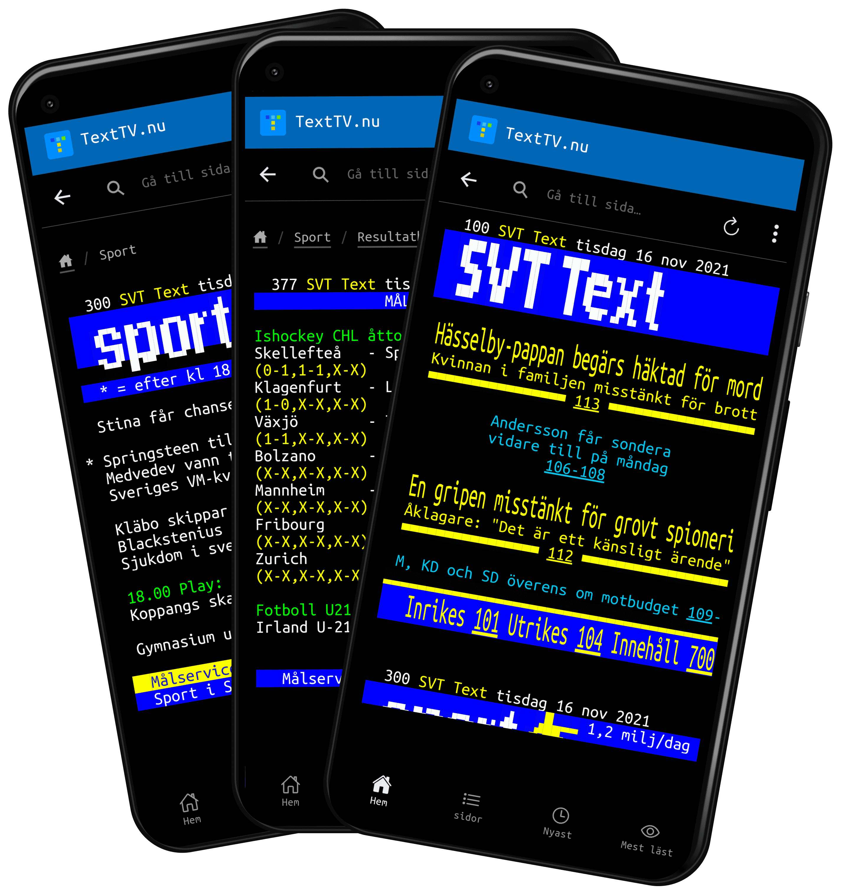

# TextTV.nu: smartare SVT Text i mobilen

Här bygger vi på [TextTV.nu](https://texttv.nu/) appar för Ios och Android.
Den är skapad i Ionic och Capacitor.

- [Ios-appen för SVT Text TV](https://itunes.apple.com/se/app/texttv.nu/id607998045).
- [Android-appen för SVT Text TV](https://play.google.com/store/apps/details?id=com.mufflify.TextTVnu2).

Vill du göra appen bättre? Bidra med kod eller rapportera buggar eller skicka in förbättringsförslag.

## Kom igång

- Använd `rbenv local` för att få igång Ruby-version som fungar på M1. Kanske måste installera om cocoapods och ffi efter ändring av ruby-version.
- Använd `nvm use` för att använda rätt Node-version.
- `npm install`
- `npm install -g @ionic/cli`
- `rbenv local`
- `sdk use java 17.0.8-zulu`
- `npm start` eller `ionic serve` (kanske även `ionic serve --external`).

### Random kommandon

Ingen inbördes ordning.

- `npx cap sync` (borde göra samma sak som ovan men verkar göra med, t.ex. köra pod update för mig)
- `capacitor open android`
- `npm run build && npx cap sync && npx cap open ios` - bygg, synka, öppna i Xcode

### Släppa ny version

- Skapa release-branch, t.ex. `release/3.6.0`.
- Uppdatera version i `package.json`.
- Uppdatera [changes.md](changes.md).
- Tagga och mergea in branch i main.

**Ios-specifika saker**

- Lägg till ny version på [App Store Connect](https://appstoreconnect.apple.com/apps/607998045/appstore/).
- `$ ionic capacitor build ios` för att bygga och öppna i Xcode.
- Uppdatera app-version i Xcode.
- I Xcode kör Product » Archive.
- Gå till organizer och ladda upp.
- Välj filen i App Store Connect, klicka i alla random saker som Apple gnäller på, och välj att skicka in till review.

**Android-specifika saker**

- Uppdatera `versionName` och `versionCode` i `android/app/build.gradle`.
- `$ ionic capacitor sync android`.
- `$ ionic capacitor open android` för att öppna i Android Studio.
- "Build => Generate Signed Bundle / APK" i Android Studio.
  - Välj "Android App bundle"
  - Bygget byggs.
- Skapa [ny release via webben i Play Store](https://play.google.com/console/u/0/developers/5182370220927018066/app/4974731206804873917/tracks/production)
- https://developer.android.com/distribute/best-practices/launch/launch-checklist
- Tagga och mergea in branch i main.

### Ändringslogg

Se [changes.md](changes.md) för att se vad som ändrats i olika versioner.

### Teknik

- Använder https://github.com/capacitor-community/admob för att visa annonser.
